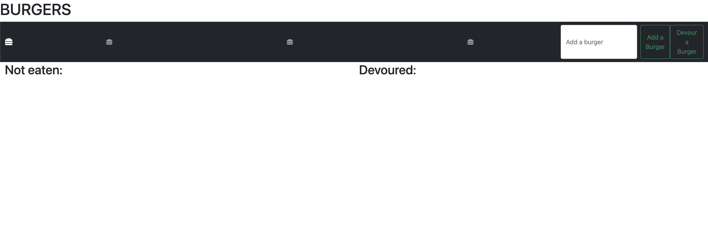

# burger - BootCamp HW 13

## Description
This is an application that lets me practice using Heroku, mysql, JawsDB, and handlebars. You can add diferent burgers, devour them, and it all interacts with a mysql database where the burgers are stored

## Installation
Go to the link where the app is running live, hosted by Heroku. Can be found here: https://thawing-cove-84833.herokuapp.com/

## Usage

## Credits
Code by CJ Hansen: https://github.com/cjrhansen2
